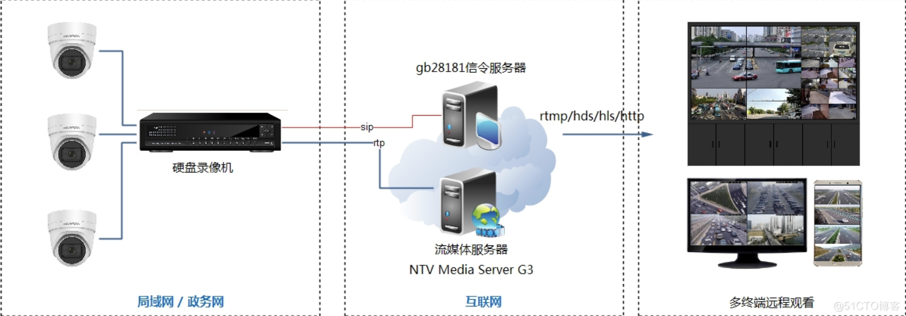

# GB28181

简介：GB28181平台包括信令服务器和流媒体服务器两个组成部分，用于远程接入监控摄像头和NVR设备，实现对监控视频的远程调取和管理。接入流媒体服务器的监控视频，通过多种协议进行分发，用于视频预览和集成到其他业务系统中。

# 流程图

除了通用的信令交换和视频接入功能，该平台还具有如下特点：

1、视频远程接入和调取

摄像头和NVR不需要有外网IP，可以直接通过GB28181协议连接到外网平台上，不需要任何中转和代理。

2、短延迟、秒开流畅
远程调取摄像头视频，延迟在1秒以内，视频秒开，流畅不卡顿。

3、转发和集成

接入的监控视频可以通过RTMP、RTP、HLS、HTTP等多种协议进行转发，方便预览和集成。

4、视频录制和回看
自动录制监控视频，按时间点进行查询和回看，录像保留时长可以自定义。

5、高性能、大并发

一台设备可以接入数百个摄像头，并提供上千并发观看。可以进行集群部署，支撑更大数量的接入和观看。
